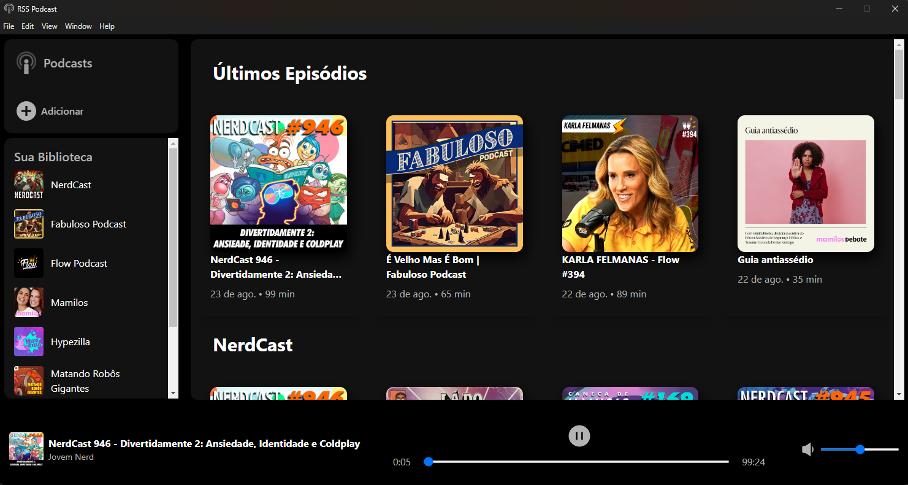

<!-- Icon https://reactsvgicons.com/ -->
<!-- Podcast RSS https://chartable.com/ -->

<p align="center"></p>

## RSS Podcasts

O RSS Podcasts é um agregador de podcasts desktop criado para manter o usuário atualizado com uma interface simples. Para isso, o RSS Podcasts armazena apenas a URL do RSS/XML do podcast que o usuário deseja. A aplicação faz uma requisição do arquivo XML, que é convertido e modelado em JSON para construção da interface feita em Next.js e Electron. Dessa forma, o usuário pode escapar das propagandas intrusivas impostas pelas principais empresas de streaming de música/podcasts.

<a href="https://nil-ton.github.io/" download="">Download RSS Podcast beta</a>


### Instalar Dependências

```
$ git clone https://github.com/Nil-ton/rss-podcasts.git

# Use npm
$ npm install
```

### Use Isso

```
# Ambiente de desenvolvimento
$ npm run dev

# Build para produção
$ npm run build
```
